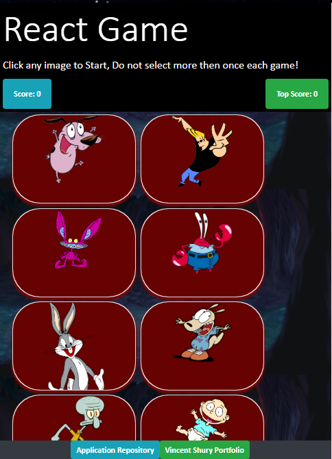

# React Memory Game
Memory game using REACT.

[LIVE APP](https://vincent440.github.io/react-memory-game/)

This games is split into components within a stateful container, using props passed to stateless components.

12 images are loaded up each time a user loads the page. 

A characters array holds ID's and images that gets displayed every render randomly using the [modern version of the Fisher–Yates shuffle](https://gist.github.com/webbower/8d19b714ded3ec53d1d7ed32b79fdbac) in ES6 JavaScript. 

on a click the ID of that image gets added to a clicked array in the Containers state, which is then used on every click event to determine either to Increase Score or to reset the game if it has already been clicked. 

### Check Out My Profile & Portfolio Here!

[Vince Shury Github Profile](https://github.com/Vincent440)

[Vince Shury Portfolio](https://vshury.com/) 